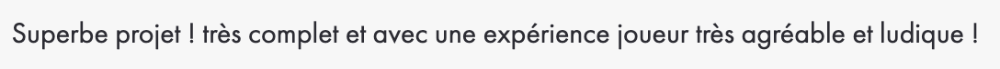

<h1 align="center">So_Long</h1>

<div align="center"></div>

Sixième projet de [42](https://42.fr/) et premier projet graphique qui utilise la [MiniLibX](https://harm-smits.github.io/42docs/libs/minilibx).

Jeu semblable à Mario Bros avec une vue de profil.

Le but du joueur est de collecter toutes les pièces présentes sur la carte puis de s'échapper avec un minimum de mouvement

---

### Compilation :

Pour compiler le projet, exécutez la commande suivante :

```
make
```

Ou avec les bonus :

```
make bonus
```

Pour compiler les tests unitaires, exécutez la commande suivante :

```
make test
```

### Utilisation :

Pour lancer le jeu, `./so_long` `adresse de la carte` `mode debug`

Exemple :

```
./so_long ./maps/map.ber DEBUG=0
```

Ou

```
./so_long-bonus ./maps/map.ber DEBUG=0
```

Les tests unitaires s'executent de la façon suivante :

```
./utest
```

### Commandes :

| Clavier | Action |
|---|---|
| <kbd>W</kbd>, <kbd>↑</kbd>| Saut |
| <kbd>S</kbd>, <kbd>↓</kbd>| Déplacement vers le bas |
| <kbd>A</kbd>, <kbd>←</kbd>| Déplacement à gauche |
| <kbd>D</kbd>, <kbd>→</kbd>| Déplacement à droite |
| <kbd>ESC</kbd>, `⎋`| Fermer le jeu |
---
### Structuration de la carte :

| Caractère | Description|
|--|--|
| `*` | Espace vide 1 |
| `0` | Espace vide 2 |
| `1` | Mur |
| `P` | Joueur |
| `E` | Porte de sortie |
| `C` | Pièce collectable |
| `M` | Monstre |

##### Exemple de carte :

```txt
111111111111111111
1P0100000000001001
10*****00000010*01
10**00*0***00**001
10*00******0*00*01
10C00C*0*****00001
100001000C0*0C0001
10001101000M0001E1
111111111111111111
```

### Démonstration :


 

 


---
### Correction :

| |
| --- |
|  |

| | |
| --- | --- |
| Correcteur 1 |  |
| Correcteur 2 |  |
| Correcteur 3 |  |
